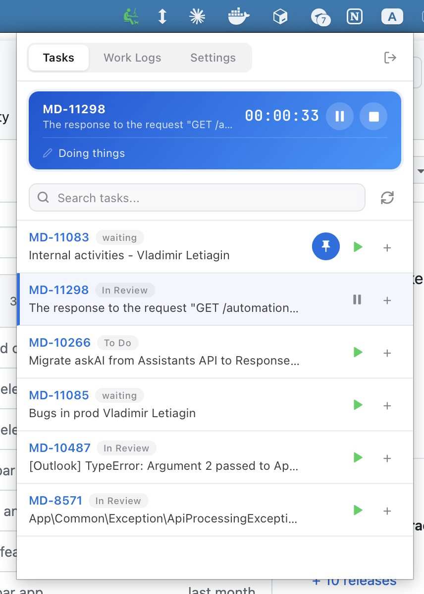
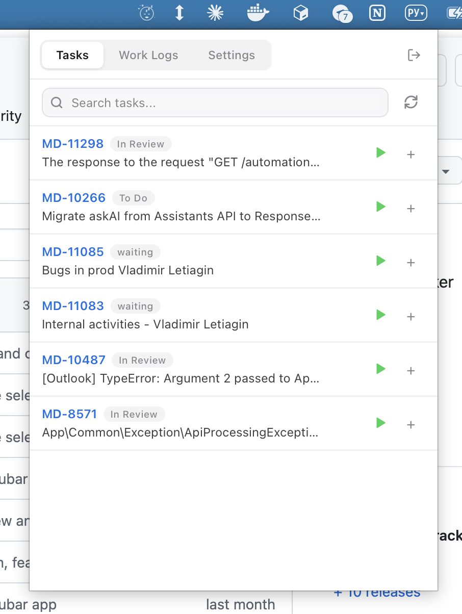
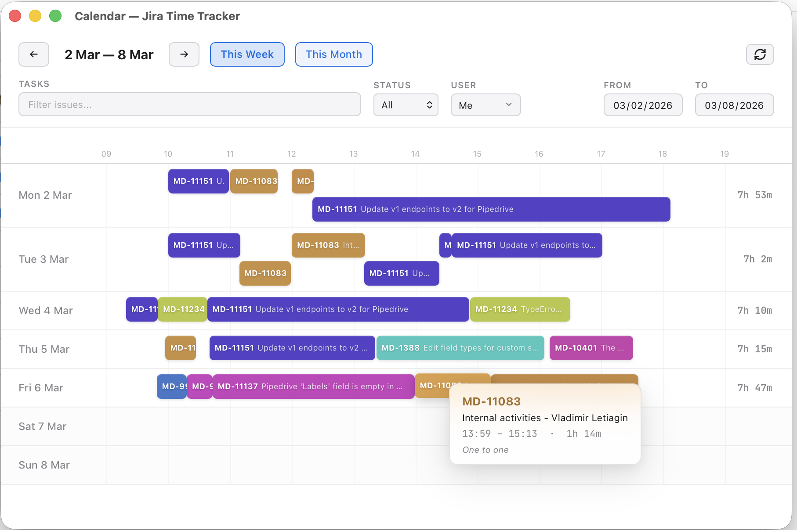
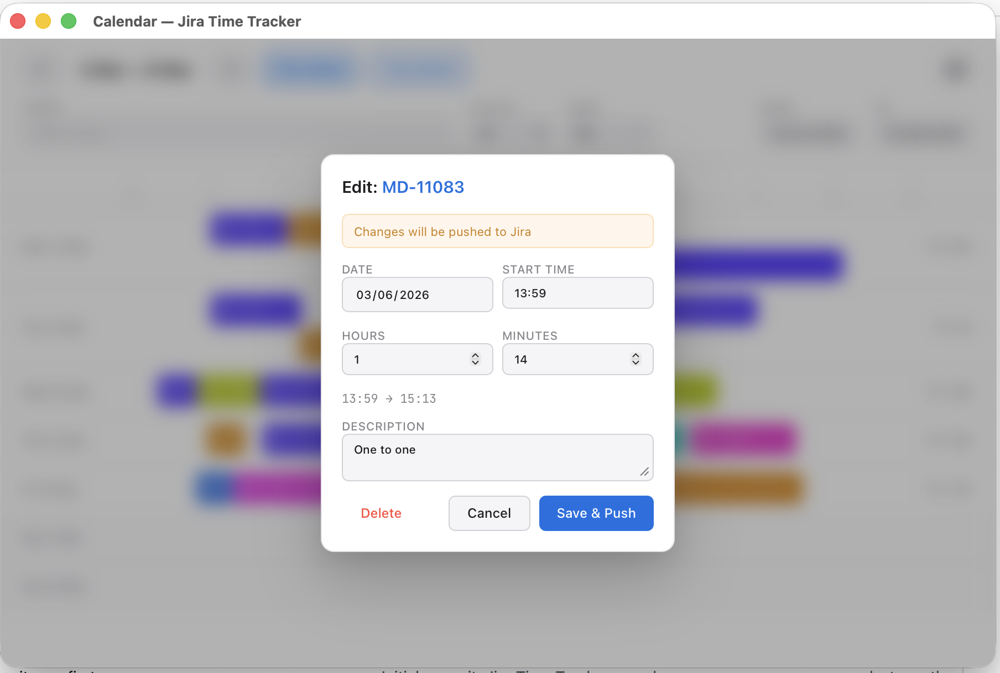
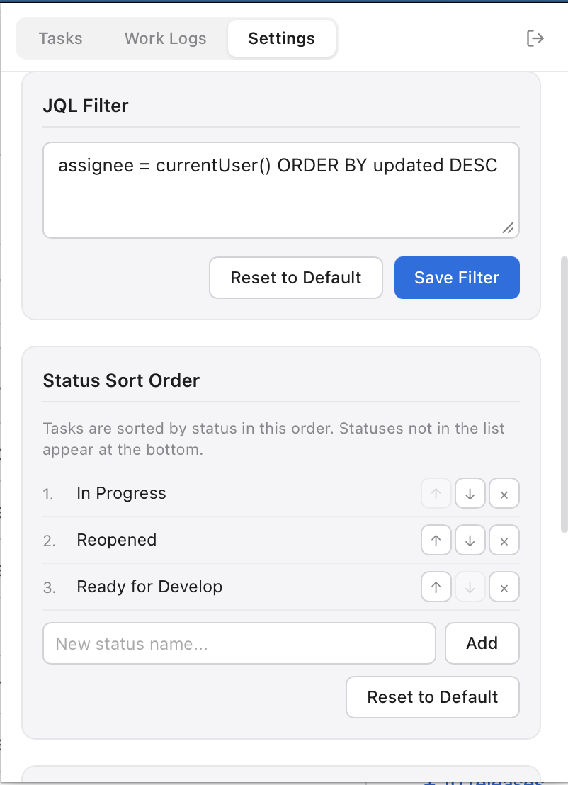

# Jira Time Tracker

A lightweight menubar app that makes Jira time tracking painless. Start a timer, do your work, push worklogs to Jira — all without leaving your workflow.

<p>
  
</p>

## Features

### One-click timer

Pick an issue from your list and hit play. The timer starts counting in the menu bar. Pause, resume, add a description of what you're working on. When you're done — stop the timer, and a worklog is ready to push.

<p>
  
</p>

### Work log management

All your worklogs in one place, organized by day. See what's pending, synced, or failed. Push a single worklog or hit **Push All** to send everything to Jira at once. Add worklogs manually when you forgot to start the timer.

<p>
  
</p>

### Calendar view

A visual timeline of where your time went. Week or month view, color-coded by issue. Hover over a block to see details. Click to edit — change time, description, or even the issue, right from the calendar.

<p>
  
</p>
<p>
  
</p>

### Custom JQL & sorting

Bring your own JQL filter to control which issues appear. Reorder status priorities so the most relevant tasks float to the top. Pin important issues so they're always within reach.

<p>
  
</p>

### And more

- **Daily report** — grouped by issue with descriptions and totals, one click to copy
- **Offline-first** — everything stored locally in SQLite, sync to Jira when you're ready
- **Dynamic tray icon** — see at a glance if a timer is running, paused, or idle
- **Import from Jira** — pull existing worklogs so you have the full picture
- **Auto-update notifications** — know when a new version is available
- **Themes** — dark, light, or match your system

## Install

Download the latest release for your platform:

**[GitHub Releases](https://github.com/JorryGo/jira-time-tracker/releases)**

| Platform | Format |
|---|---|
| macOS (Apple Silicon & Intel) | `.dmg` |
| Windows | `.exe` (NSIS installer) |
| Linux | `.AppImage`, `.deb` |

## Setup

1. Open the app — it lives in your system tray (menu bar on macOS)
2. Click the tray icon → go to **Settings**
3. Enter your Jira base URL, email, and [API token](https://id.atlassian.com/manage-profile/security/api-tokens)
4. Hit **Test Connection** → **Save**
5. Your issues will load automatically based on the JQL filter

## Development

### Prerequisites

- [Node.js](https://nodejs.org/) 22+
- [Rust](https://rustup.rs/) stable
- [Tauri prerequisites](https://v2.tauri.app/start/prerequisites/)

### Run

```bash
npm install
npm run tauri dev
```

### Build

```bash
npm run tauri build
```

Output goes to `src-tauri/target/release/bundle/`.

## Tech stack

Tauri 2 · Svelte 5 · TypeScript · Rust · SQLite
